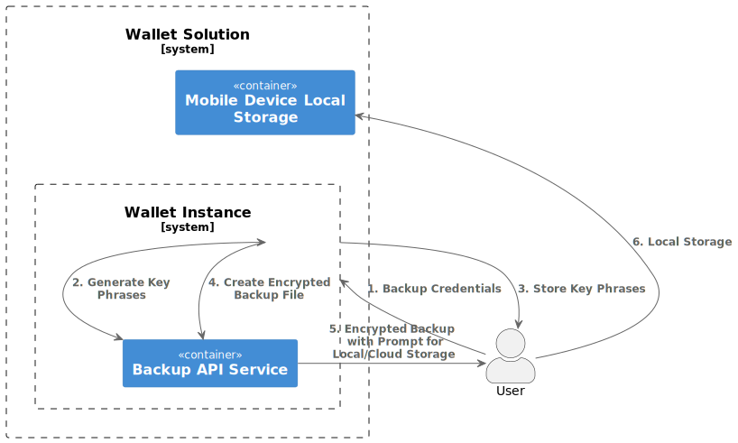
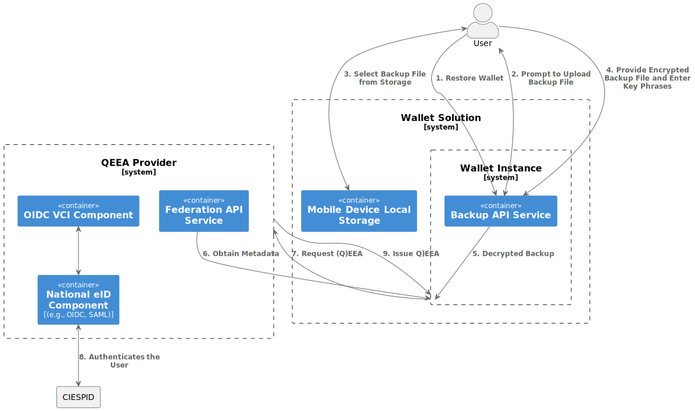

.. include:: ../common/common_definitions.rst

.. _backup-restore.rst:

Backup and Restore
+++++++++++++++++++++++++++
The relevant scenario for the **Backup and Restore** functionality is when the User can no longer access the credentials (e.g., electronic attestations of attributes) that were stored on the mobile device on which the Wallet Instance was installed. 
The situations that may demand the User to use this functionality are as the following:

- The mobile device has either been **lost**, **stolen**, **broken** or **hacked** (e.g., a result of unauthorized access to the device).
- The User replaces an existing installation of a **Wallet Solution** with a new installation of the **same Wallet Solution**.
- The User has changed his mobile device and need to setup the **Wallet Solution** in his new mobile device.
- The User **factory resets** the current phone and needs to set up the Wallet Solution again.

.. note::
  
  The Backup and Restore functionality is different from migrating to another Wallet Solution (a.k.a. Data portability). 
  In the latter case, we are dealing with a scenario in which the User wants to migrate from his current Wallet Solution to a different one due to ceases to support the Wallet Solution as highlighted in Annex 2 of `ARF`_.    

Backup Flow
------------

1hy43EyuUAqzewxf0PoK2KplNsyd5TRVWxsmSaFkXqpWPPBWOdqDIOni8dyBCOSxKqb56pOEjv6yJV_XBKK8RaoD2iRg51zD1fkdSFNJAbbB1eMz2GpOV0kUEz8CNuq3QxoCuqgz5RCKo3-ricb8VycNC9zPYBJS_A00Pv0jgkMB0lwEjd8qEB14vHTbjSp4tlUBwB6_cT7aPG7lIPD39lX0FQnRXvwEsqINsD98lYhIBXw77Gy_BMBhCVfArwwtJCqqqZkfQ7JRG_VRU5qSmX64png6Ckmajx1sfhFf4l_Nqa7BbJAXcSwQ8X_sFZ_L6FYcW0JEaNFIJUZK7m00

Below, the description of the steps on Figure 1.:

**Step 1**: The user clicks on the backup credentials option in the Wallet Instance. 

**Steps 2-3**: The Wallet Instance using the Backup APIs randomly selects 10 key phrases from a pre-generated list of words and displays it to the User. The User MUST write down or store the key phrases in a secure place as the backup is encrypted using the generated phrases. To extract the key from the list of selected words a key derivation function MUST be applied. Password-Based-Key-Derivation Function 2 (PBKDF2) is among the mostly used ones based on `RFC 2898`_ and it is recommended by the `NIST 800-132 <https://nvlpubs.nist.gov/nistpubs/Legacy/SP/nistspecialpublication800-132.pdf>`_. There are other relevant techniques that are available and used widely, such as Bcrypt, Scrypt, and Argon2 (used by Hyperledger Indy within Connect.me Wallet). More details on this approach can be found `here <https://cryptobook.nakov.com/mac-and-key-derivation/kdf-deriving-key-from-password>`_.

**Step 4**: The Wallet Instance performs the defined operations below to create the backup file. The reason for encryption is that the backup file is considered sensitive as highlighted in the `ARF`_. To elaborate, even if the attacker knows only the Issuer identifier of a certain credential, it enables him to know the different type of credentials that are released by this entity and can be a violation of user privacy.
 
- For each of the HW bound key credentials, add the ``iss``, ``credential_configuration_id`` as an entry in the backup file. 
- Sign the backup file using the private key that its public key is attested within the Wallet Attestation. The related public key that is attested by the Wallet Provider is provided within the Wallet Attestation (``cnf`` claim). The Wallet Instance MUST verify the validity of the Wallet Attestation before signing the backup file.
- Encrypt the backup file using the provided key phrases. 

**Step 5**: The User will be prompted to select the storage for securely storing the backup file based on his preference. This can range from native storage to external storage (e.g., cloud storage, usb, etc.). 

**Step 6**: Considering the native storage as the preferred choice, the file will be stored on the User device.

A non-normative example of the backup file is as the following:
 
 .. code-block::
  
  {
    "timestamp":"2024-12-13T16:35:06+01:00",
    "wallet_provider_id":"https://wallet-provider.example.org/",
    "wallet_version":"v1.0",
    "wallet_attestation":"eyJhbGciOiJFUzI1NiIsImVVfQz.eyJpc3MiOiAiaH...LCAibmJ",
    "credentials_backup":[
     {  
        "iss": "https://issuer.example.org/v1.0/mdl",
        "credential_configuration_id":"org.iso.18013-5.1.mDL"
     },
     {  
        "iss": "https://eaa-provider.example.org/",
        "credential_configuration_id":"EuropeanDisabilityCard"
     },
   ]
  }

The backup file contains the following REQUIRED claims:

.. list-table::
    :widths: 20 60 
    :header-rows: 1

    * - **Claim**
      - **Description**
    * - **timestamp**
      - UNIX timestamp with the time of backup file creation. This value is updated every time a new credential entry is added to the backup file.
    * - **wallet_provider_id**
      - It MUST be set to the identifier of the Wallet Provider.
    * - **wallet_version**
      - It MUST be set to  the version of the Wallet Solution that has been backuped.
    * - **wallet_attestation**
      - It MUST be set to a value containing the Wallet Attestation JWT. 
    * - **credentials_backup**
      - Array of JSON objects that contains the following claims for each credentials that are backuped:
        
        - ``iss``: Credential issuer identifier. It provides the identifier of the credential issuer to initiate the credential issuance.
        - ``credential_configuration_id``: Unique identifier of the credential. It provides a way to identify the specific credential that is issued, in case the Issuer can issue multiple credentials. This parameter then can be automatically filled in the authorization request during the re-issuance.

Restore flow for Hardware Binding Credential
----------

rf7E3jnd49v_WsCJ1ZA27i5r986hvszltGB5hxeQL6f6xbOru74JWi5q32aOs8PyoB8sNDf2QPg5kN0UoKbpXXEA49nPWHhIRIgVH1wsfxuXmgcpjqgI2peNez40rkT4jkfQ9SMjK27pV7moXA_3SRWiAsl8SEYrdMmmxWqrZKy2y7brWd3SWC9Db_9vlWjHSHTcWydPpfRKDKciOjbJakGQfVQQucmlOI0b83WIZ6Qk2OIsde0jjERA7XE6uz5i6lgvJ_peTwMLK0mQbxPcGFcpzboIORYs3YhhLIojp3nhVG7eVLyeASdyw1r2smzHzWjfZ9nVgCfdZH5x8V6f0s0VEWV5uQiy03u84oGd7VIBmqx23lx3lSxZX6N5SU3BIbkKi7BKgTBqLAKzG99uayECD0dU1E4wg49AJ2hFZv1azlBrhc5aX5jMJBAbY4Q66muYdsW9quL3Jpv9RmtNsrffAl8s3tP_8fuaabcU1T_bS5v4Ny6462KohhXsSiDl_XwGyFVnyzpKv1cw5plHLudUS7jQyCfRYVgGmw3c1HbM0fayX7U8QqnmgyvpZN_COUnzJT2KRK38LdzaAhdPGs0wsH4PMPVw3m00

Considering the User has initialized the new Wallet Instance and it is in active state by obtaining a new PID , we relax the requirement of the ARF concerning adding the PID inside the backup file. Below, the description of the steps on Figure 2.:

**Steps 1-5**: The User wants to restore the Wallet with the backup that the User has from the previous Wallet Instance. The User selects `restore Wallet` in the Wallet Instance app, where he prompts to upload the backup file from the local storage (It is possible to upload the backup from the cloud storage as well) and enter the recovery key phrases. To check the authenticity of the file, it MUST verify the signature of the backup file. To do this, it first extracts the Wallet Attestation JWT from ``wallet_attestation`` claim and obtains the related public key using the Wallet Attestation (``cnf`` claim).

**Steps 6-9**: The Wallet Instance for each HW binding credentials entry in the backup file performs the following steps:

- It checks the ``iss``, ``credential_configuration_id`` from the entry. The former is used to identify the Issuer and obtains its metadata, while the latter will be used to signal the credential type to the (Q)EAA provider. 
- Using the Issuer identifier the Wallet Instance obtains the metadata of the (Q)EAA Provider and makes a re-issuance request to the (Q)EAA by providing the new HW key to bind the credential. 

.. note::
  
  The Wallet Instance MUST not check the expiration of the Wallet Attestation as its main purpose is to enable the Wallet Instance to verify the authenticity of the backup file by ensuring it has been created and signed by a Wallet Instance of a specific Wallet Provider.

 

.. _ARF: https://github.com/eu-digital-identity-wallet/eudi-doc-architecture-and-reference-framework

.. _RFC 2898: http://tools.ietf.org/html/rfc2898.html