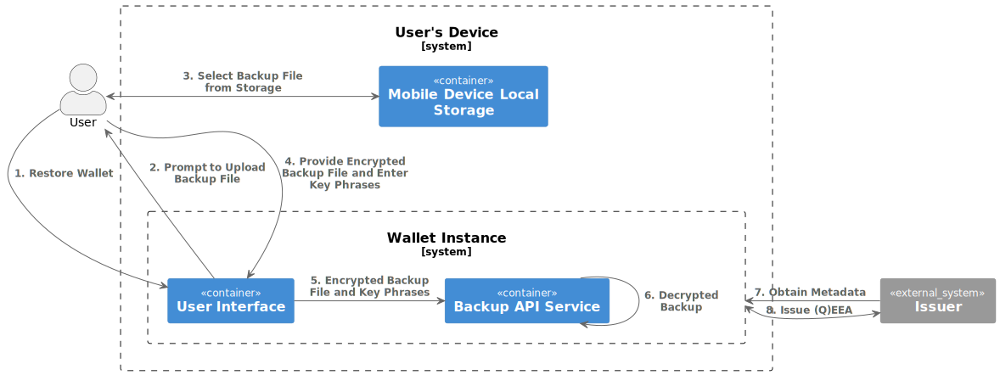

.. include:: ../common/common_definitions.rst

.. _backup-restore.rst:

Backup and Restore
+++++++++++++++++++++++++++
The relevant scenario for the **Backup and Restore** functionality is when the User can no longer access the Digital Credentials that were stored on the mobile device on which the Wallet Instance was installed. 
The situations that may demand the User to use this functionality are as the following:

- The mobile device has either been **lost**, **stolen**, **broken** or **hacked** (e.g., a result of unauthorized access to the device).
- The User replaces an existing installation of a Wallet Solution with a **new installation of the same Wallet Solution**.
- The User has **changed his mobile device** and need to setup the Wallet Solution in his new mobile device.
- The User **factory resets** the current phone and needs to set up the Wallet Solution again.

.. note::
  
  The Backup and Restore functionality is different from migrating to another Wallet Solution (a.k.a. Data portability). 
  In the latter case, we are dealing with a scenario in which the User wants to migrate from his current Wallet Solution to a different one due to ceases to support the Wallet Solution as highlighted in Annex 2 of `ARF`_.    

Backup Flow
------------

.. _fig_Backup_flow:
.. figure:: ../../images/Backup_flow.svg
   :name: Sequence Diagram for Wallet Instance Backup
   :alt: The figure illustrates the sequence diagram for backup flow, with the steps explained below.
   :target: https://www.plantuml.com/plantuml/svg/ZP5VRzCm5CNV_IakUM58914mU9YgQbiPQ6AJAbKJ3u2cc-JI61pRigyf4UAx4pk4aROFyrDxRdxdt3_ddj5nw9Hu8dMjGaFGCbj_LfOETyLMSXkguCdLHZDfBchJbLQXZapkkL6oAbUd-JfATxStPOUUoGtI_MeWK6foXOt-0cis3ku6Bq0FMVoH2R7fFLDtVsc2Rj3r9pjKYdXZL61fz7F8FYO19YLx1hy43EyuUAqzewxf0PoK2KplNsyd5TRVWxsmSaFkXqpWPPBWOdqDIOni8dyBCOSxKqb56pOEjv6yJV_XBKK8RaoD2iRg51zD1fkdSFNJAbbB1eMz2GpOV0kUEz8CNuq3QxoCuqgz5RCKo3-ricb8VycNC9zPYBJS_A00Pv0jgkMB0lwEjd8qEB14vHTbjSp4tlUBwB6_cT7aPG7lIPD39lX0FQnRXvwEsqINsD98lYhIBXw77Gy_BMBhCVfArwwtJCqqqZkfQ7JRG_VRU5qSmX64png6Ckmajx1sfhFf4l_Nqa7BbJAXcSwQ8X_sFZ_L6FYcW0JEaNFIJUZK7m00

   Backup flow.

Below, the description of the steps of :numref:`fig_Backup_flow`:

**Step 1**: The User clicks on the backup credentials option in the Wallet Instance. 

**Steps 2-3**: The Wallet Instance using the Backup APIs randomly selects 10 key phrases from a pre-generated list of words and displays it to the User. 
The User MUST write down or store the key phrases in a secure place as the backup is encrypted using the generated phrases. 

.. note::
  
  As highlighted in the `ARF`_, the reason for encryption is due to the fact that the backup file is considered sensitive. Indeed, even if the attacker knows only the 
  Issuer identifiers of the Digital Credentials, it enables him to know the different types of Digital Credentials and this is a violation of user privacy.

.. note::
  
  To extract the key from the list of selected words a key derivation function MUST be applied. Password-Based-Key-Derivation Function 2 (PBKDF2) is among the mostly used ones based on `RFC 2898`_ and it is recommended by the `NIST 800-132 <https://nvlpubs.nist.gov/nistpubs/Legacy/SP/nistspecialpublication800-132.pdf>`_. There are other relevant techniques that are available and used widely, such as Bcrypt, Scrypt, and Argon2 (used by Hyperledger Indy within Connect.me Wallet). More details on this approach can be found `here <https://cryptobook.nakov.com/mac-and-key-derivation/kdf-deriving-key-from-password>`_.

**Step 4**: The Wallet Instance performs the operations below to create the backup file. 
 
- For each of the HW bound key credentials, add the ``iss``, ``credential_configuration_id`` as an entry in the backup file. 
- Sign the backup file using the private key that its public key is attested within the Wallet Attestation. The related public key that is attested by the Wallet Provider is provided within the Wallet Attestation (``cnf`` claim). The Wallet Instance MUST verify the validity of the Wallet Attestation before signing the backup file.
- Encrypt the backup file using the provided key phrases. 

**Step 5**: The User will be prompted to select the storage for securely storing the backup file based on his preference. This can range from native storage to external storage (e.g., cloud storage, usb, etc.). 

**Step 6**: Considering the native storage as the preferred choice, the file will be stored on the User device.

A non-normative example of the backup file is as the following:
 
 .. code-block::
  
  { "alg": "ES256",   
    "kid": "vbeXJksM45xphtANnCiG6mCyuU4jfGNzopGuKvogg9c",
    "typ": "wallet_instance_backup+jwt",    
  }
  .
  {
    "timestamp":"2024-12-13T16:35:06+01:00",
    "wallet_provider_id":"https://wallet-provider.example.org/",
    "wallet_instance_version":"v1.0",
    "wallet_attestation":"eyJhbGciOiJFUzI1NiIsImVVfQz.eyJpc3MiOiAiaH...LCAibmJ",
    "credentials_backup":[
     {  
        "iss": "https://issuer.example.org/v1.0/mdl",
        "credential_configuration_id":"org.iso.18013-5.1.mDL"
     },
     {  
        "iss": "https://eaa-provider.example.org/",
        "credential_configuration_id":"EuropeanDisabilityCard"
     },
   ]
  }

The JOSE header of the backup JWT MUST contain the following REQUIRED claims:

.. list-table::
    :widths: 20 60 20
    :header-rows: 1

    * - **JOSE header**
      - **Description**
      - **Reference**
    * - **alg**
      - A digital signature algorithm identifier such as per IANA "JSON Web Signature and Encryption Algorithms" registry. It MUST be one of the supported algorithms listed in the Section `Cryptographic Algorithms <algorithms.html>`_ and MUST NOT be set to ``none`` or any symmetric algorithm (MAC) identifier.
      - :rfc:`7516#section-4.1.1`.
    * - **kid**
      -  Unique identifier of the ``jwk`` inside the ``cnf`` claim of Wallet Instance as base64url-encoded JWK Thumbprint value.
      - :rfc:`7638#section_3`.
    * - **typ**
      -  It MUST be set to ``wallet-instance-backup+jwt``
      - 

The body of backup JWT contains the following REQUIRED claims:

.. list-table::
    :widths: 20 60 
    :header-rows: 1

    * - **Claim**
      - **Description**
    * - **timestamp**
      - UNIX timestamp with the time of backup file creation. This value is updated every time a new credential entry is added to the backup file.
    * - **wallet_provider_id**
      - It MUST be set to the identifier of the Wallet Provider.
    * - **wallet_instance_version**
      - It MUST be set to  the version of the Wallet Solution that has been backed up.
    * - **wallet_attestation**
      - It MUST be set to a value containing the Wallet Attestation JWT. 
    * - **credentials_backup**
      - Array of JSON objects that contains the following claims for each credentials that are backuped:
        
        - ``iss``: Credential Issuer identifier. It provides the identifier of the Credential Issuer to initiate the issuance phase.
        - ``credential_configuration_id``: Unique identifier of the Digital Credential. It provides a way to identify the specific Digital Credential that is issued, in case the Issuer can issue multiple Digital Credentials. This parameter then can be automatically filled in the authorization request during the re-issuance.

Restore flow for Hardware Binding Credential
----------

.. _fig_Restore_flow:
rf7E3jnd49v_WsCJ1ZA27i5r986hvszltGB5hxeQL6f6xbOru74JWi5q32aOs8PyoB8sNDf2QPg5kN0UoKbpXXEA49nPWHhIRIgVH1wsfxuXmgcpjqgI2peNez40rkT4jkfQ9SMjK27pV7moXA_3SRWiAsl8SEYrdMmmxWqrZKy2y7brWd3SWC9Db_9vlWjHSHTcWydPpfRKDKciOjbJakGQfVQQucmlOI0b83WIZ6Qk2OIsde0jjERA7XE6uz5i6lgvJ_peTwMLK0mQbxPcGFcpzboIORYs3YhhLIojp3nhVG7eVLyeASdyw1r2smzHzWjfZ9nVgCfdZH5x8V6f0s0VEWV5uQiy03u84oGd7VIBmqx23lx3lSxZX6N5SU3BIbkKi7BKgTBqLAKzG99uayECD0dU1E4wg49AJ2hFZv1azlBrhc5aX5jMJBAbY4Q66muYdsW9quL3Jpv9RmtNsrffAl8s3tP_8fuaabcU1T_bS5v4Ny6462KohhXsSiDl_XwGyFVnyzpKv1cw5plHLudUS7jQyCfRYVgGmw3c1HbM0fayX7U8QqnmgyvpZN_COUnzJT2KRK38LdzaAhdPGs0wsH4PMPVw3m00

   Restore flow.

Considering that the User has initialized the new Wallet Instance and it is in active state by obtaining a new PID, this specification relaxes the requirement of the ARF concerning the addition of the PID in the backup file. 
Below, the description of the steps of :numref:`fig_Restore_flow`:

**Steps 1-5**: The User wants to restore the Wallet with the backup that the User has from the previous Wallet Instance. 
The User selects `restore Wallet` in the Wallet Instance app, where he is prompted to upload the backup file from the local storage (it is possible to upload the backup file from the cloud storage as well) and enter the recovery key phrases. 
To check the authenticity of the file, it MUST verify the signature of the backup file. To do this, it first extracts the Wallet Attestation JWT from ``wallet_attestation`` claim and obtains the related public key using the Wallet Attestation (``cnf`` claim).

**Steps 6-9**: The Wallet Instance for each HW binding credentials entry in the backup file performs the following steps:

- It extracts ``iss``, ``credential_configuration_id`` from the entry. The former is used to identify the Issuer and obtains its metadata, while the latter will be used to signal the credential type to the (Q)EAA provider. 
- Using the Issuer identifier the Wallet Instance obtains the metadata of the (Q)EAA Provider and makes a re-issuance request to the (Q)EAA by providing the new HW key to bind the credential. 

.. note::
  
  The Wallet Instance MUST not check the expiration of the Wallet Attestation as its main purpose is to enable the Wallet Instance to verify the authenticity of the backup file by ensuring it has been created and signed by a Wallet Instance of a specific Wallet Provider.

 

.. _ARF: https://github.com/eu-digital-identity-wallet/eudi-doc-architecture-and-reference-framework

.. _RFC 2898: http://tools.ietf.org/html/rfc2898.html