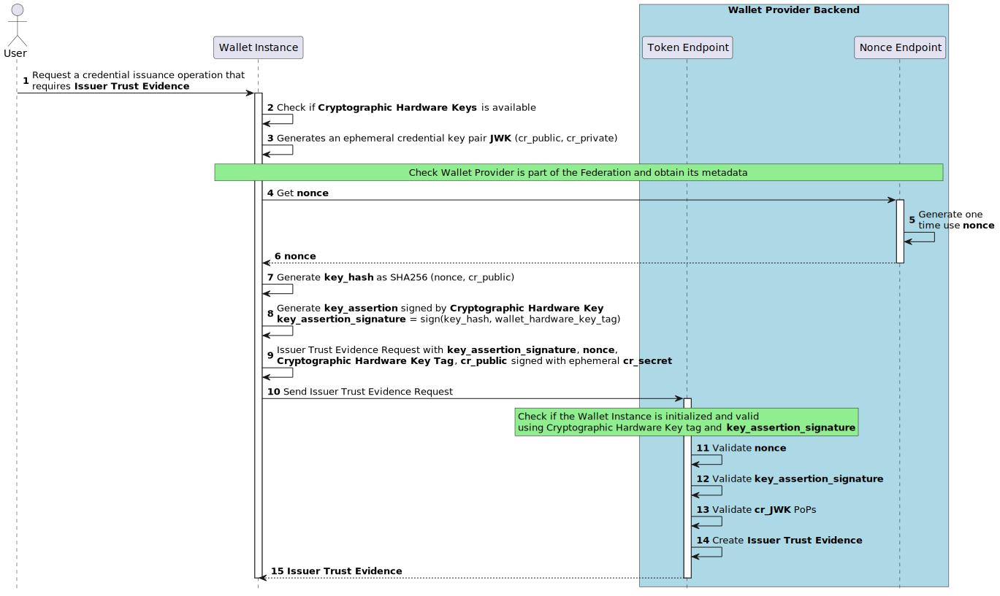

.. include:: ../common/common_definitions.rst

.. _wallet-trust-evidence.rst:

Wallet Trust Evidence
+++++++++++++++++++++

In the context of eIDAS 2.0, there is a requirement which is stated "An attestation that is issued by the Wallet Provider is needed to ensure that the keys used for key binding of credentials 
are really reside in a trustworthy Wallet Secure Cryptographic Device (WSCD)." We called this attestation Wallet Trust Evidence (WTE). 

Requirements
------------

The requirements for the Wallet Trust Evidence are defined below:

- The Wallet Trust Evidence MUST contain one or multiple attested credential's public key that are coming from the same WSCD.
- The Wallet Trust Evidence MUST use the signed JSON Web Token (JWT) format;
- The Wallet Trust Evidence MUST provide all the relevant information to attest the trustworthiness of the WSCD component where the private keys are stored.
- The Wallet Trust Evidence MUST be signed by the Wallet Provider or the WSCD component.
- The Wallet Provider MUST ensure the trustworthiness of the WSCD, preventing any attempts at manipulation or falsification by unauthorized third parties. 
- The Wallet Trust Evidence MUST be used once and during its validity period, with the need to request new attestations with each interaction.
- The Wallet Trust Evidence MUST be short-lived and MUST have an expiration date/time, after which it SHOULD no longer be considered valid.
- The Wallet Trust Evidence MUST NOT be issued by the Wallet Provider or the WSCD component if the WSCD trustworthiness is not guaranteed. In this case, the Wallet Instance MUST be revoked.
- The Wallet Provider MUST offer a set of services, exclusively available to its Wallet Solution instances, for the issuance of Wallet Trust Evidence.

Wallet Trust Evidence Issuance
~~~~~~~~~~~~~~~~~~~~~~~~~~~~~~

This section describes the Wallet Trust Evidence format and how the Wallet Provider issues it.

SGeIPj0PZCfyzqLaV897-jrIP40e0fNas68DDiOMbSCt592jTy0LyjG5GTj04RBiLZ2YU19QgHwhV2d8ChN4hf59fpJos_QvggXOWdsHogkmQTWl0ZQLBU06G_cAWU2EDZ7Bf3VW6csDyvfCZ-2Qd6eXsNP0JKKhMTPzrKlQG8CsI8llptT2TLQ4MTFEQrlae8yX2Jit9ZZF17vDGLNcQeuuVdjzCxb-78_lJIVs-714cTeC_aNS8FX6vPivACRwEQDrO3d2YXXBP5J3Kokp7KGRwIGi4fq_yYiTaVxjSTt4u1t1L6PSaGQiLvlGdJ-zjoKTSffJDWfU_9fL62jn2YCytNnz_-4Zd2MM77RMdGzKOumKr06XY7RXIFAr6JnX0KxTKV5CIv7RGBBxEH6TlMdBuJMTWYmwafdkC2xwiav6SPViLyiL3BJCzzRbKpSa7YQuwF0xT_Q3QvjUBXCcKX68isohDPtgazx2GSLcdmcfw8TLbldfhDekaqTV6usiTLPlX_rBPShfMfvBqqRh5Z0mgbYiy27Zzl4MJTlfVYaxSY-a9pS7I4_2nSlkIZ_uXzY3N0KImC3NQ7z11a0b7HZUNqkbkP0vsrNz3m00

   Wallet Trust Evidence Issuance.

**Step 1**: The User initiates a credential issuance operation that necessitates the acquisition of the Wallet Trust Evidence.

**Steps 2-3**: The Wallet Instance checks if a Cryptographic Hardware Key exists and generates an ephemeral asymmetric key pair (``cr_public``, ``cr_private``). The Wallet Instance also:

  1. MUST ensure that Cryptographic Hardware Keys exist. If they do not exist, it is necessary to reinitialize the Wallet.
  2. MUST generates an ephemeral asymmetric key pair whose public key (``cr_public``) will be attested in ``attested_keys`` claim of the Wallet Trust Evidence.
  3. MUST check if Wallet Provider is part of the federation and obtain its metadata.

**Steps 4-6**: The Wallet Instance solicits a one-time "challenge" from the Wallet Provider Nonce endpoint. This "challenge" takes the form of a "nonce," which is required to be unpredictable and serves as the main defense against replay attacks. The Nonce endpoint MUST produce the "nonce" in a manner that ensures its single-use within a predetermined time frame.

.. code-block:: http

    GET /nonce HTTP/1.1
    Host: walletprovider.example.com

.. code-block:: http

    HTTP/1.1 200 OK
    Content-Type: application/json

    {
      "nonce": "d2JhY2NhbG91cmVqdWFuZGFt"
    }

**Step 7**: The Wallet Instance performs the following actions:

  * Creates a JSON structure that includes the nonce and the thumbprint of ephemeral public jwk of ``cr_public``.
  * Computes ``key_hash`` by applying the SHA256 algorithm to the abovementioned JSON structure.

Below a non-normative example of the ``client_data``.

.. code-block:: json

  {
    "nonce": "0fe3cbe0-646d-44b5-8808-917dd5391bd9",
    "jwk_thumbprint": "vbeXJksM45xphtANnCiG6mCyuU4jfGNzopGuKvogg9c"
  }

**Steps 8-9**: The Wallet Instance takes the following steps:

  *  It produces a ``key_assertion_signature`` by signing the ``key_hash`` with the Wallet Hardware's private key, serving as a proof of possession for the Cryptographic Hardware Keys.
  *  Constructs the Wallet Trust Evidence Request (see :ref:`Table of the Wallet Trust Evidence Request Body <table_wallet_trust_evidence_request_claim>` below) in the form of a JWT. This JWT includes the ``key_assertion_signature``, ``nonce``, ``hardware_key_tag``, and ``cnf`` which is signed using the private key of the initially generated credential ephemeral key pair (``cr_private``).

.. note:: ``integrity_assertion`` is a custom payload generated by Device Integrity Service, signed by device OEM and encoded in base64 to have uniformity between different devices.

**Step 10**: The Wallet Instance submits the Wallet Trust Evidence Request to the Wallet Trust Evidence issuance endpoint of the Wallet Provider Backend.
   
Below an non-normative example of the Wallet Attestation Request JWT without encoding and signature applied:

.. code-block::

  {
    "alg": "ES256",
    "kid": "vbeXJksM45xphtANnCiG6mCyuU4jfGNzopGuKvogg9c",
    "typ": "wter+jwt"
  }
  .
  {
    "iss": "https://wallet-provider.example.org/instance/vbeXJksM45xphtANnCiG6mCyuU4jfGNzopGuKvogg9c",
    "sub": "https://wallet-provider.example.org/",
    "nonce": "6ec69324-60a8-4e5b-a697-a766d85790ea",
    "key_assertion_signature": "KoZIhvcNAQcCoIAwgAIB...redacted",
    "hardware_key_tag": "WQhyDymFKsP95iFqpzdEDWW4l7aVna2Fn4JCeWHYtbU=",
    "cnf": {
      "jwk": {
        "crv": "P-256",
        "kty": "EC",
        "x": "4HNptI-xr2pjyRJKGMnz4WmdnQD_uJSq4R95Nj98b44",
        "y": "LIZnSB39vFJhYgS3k7jXE4r3-CoGFQwZtPBIRqpNlrg"
      }
    },
    "iat": 1686645115,
    "exp": 1686652315
  }

The Wallet Instance MUST do an HTTP request to the Wallet Provider's `Wallet Trust Evidence issuance endpoint`_,
using the method `POST <https://datatracker.ietf.org/doc/html/rfc6749#section-3.2>`__.

The **Wallet Trust Evidence issuance** endpoint (act as an token endpoint which is defined in `RFC 7523 section 4`_) requires the following parameters
encoded in ``application/x-www-form-urlencoded`` format:

* ``grant_type`` set to ``urn:ietf:params:oauth:grant-type:jwt-bearer``;
* ``assertion`` containing the signed JWT of the Wallet Trust Evidence Request.

.. code-block:: http

    POST /wallet-trust-evidence HTTP/1.1
    Host: wallet-provider.example.org
    Content-Type: application/x-www-form-urlencoded

    grant_type=urn%3Aietf%3Aparams%3Aoauth%3Agrant-type%3Ajwt-bearer
    &assertion=eyJhbGciOiJFUzI1NiIsImtpZCI6ImtoakZWTE9nRjNHeG...

**Steps 11-14**: The Wallet Provider Backend assesses the Wallet Trust Evidence Request and issues a Wallet Trust Evidence, if the requirements described below are satisfied:

    1. It MUST check the Wallet Trust Evidence Request contains all the defined HTTP Request header parameters according to :ref:`Table of the Wallet Trust Evidence Request Header <table_wallet_trust_evidence_request_claim>`.
    2. It MUST verify that the signature of the received Wallet Trust Evidence Request is valid and associated with credential public ``jwk`` (``cr_public``).
    3. It MUST verify that the ``nonce`` was generated by  Wallet Provider and has not already been used.
    4. It MUST check that there is a Wallet Instance registered with that ``hardware_key_tag`` and that it is still valid.
    5. It MUST reconstruct the ``key_hash`` via the ``nonce`` and the ``jwk`` public key, to validate ``key_assertion_signature`` via the Cryptographic Hardware Key public key registered and associated with the Wallet Instance.
    6. It MUST check that the URL in ``iss`` parameter is equal to the URL identifier of Wallet Provider.

If all checks are passed, Wallet Provider issues a Wallet Trust Evidence with an expiration limited to 24 hours.

Below an non-normative example of the Wallet Trust Evidence without encoding and signature applied:

.. code-block::

    {
    "alg": "ES256",
    "kid": "5t5YYpBhN-EgIEEI5iUzr6r0MR02LnVQ0OmekmNKcjY",
    "trust_chain": [
      "eyJhbGciOiJFUz...6S0A",
      "eyJhbGciOiJFUz...jJLA",
      "eyJhbGciOiJFUz...H9gw",
    ],
    "typ": "keyattestation+jwt",
  }
  .
  {
    "iss": "https://wallet-provider.example.org",
    "attested_keys": [
      {
        "crv": "P-256",
        "kty": "EC",
        "x": "4HNptI-xr2pjyRJKGMnz4WmdnQD_uJSq4R95Nj98b44",
        "y": "LIZnSB39vFJhYgS3k7jXE4r3-CoGFQwZtPBIRqpNlrg"
      }
    ],
    "key_storage": [
      "iso_18045_moderate"
    ],
    "user_authentication": [
      "iso_18045_moderate"
    ],

    "iat": 1687281195,
    "exp": 1687288395
  }

**Step 15**: The response is returned by the Wallet Provider. If successful, the HTTP response code MUST be set with the value ``200 OK`` and contain the Wallet Trust Evidence signed by the Wallet Provider. The Wallet Instance therefore performs security, integrity and trust verification about the Wallet Trust Evidence and its issuer.

Below is a non-normative example of the response.

.. code-block:: http

    HTTP/1.1 200 OK
    Content-Type: application/jwt

    eyJhbGciOiJFUzI1NiIsInR5cCI6IndhbGx ...

.. _table_wallet_trust_evidence_request_claim:

Wallet Attestation Request
~~~~~~~~~~~~~~~~~~~~~~~~~~

The JOSE header of the Wallet Attestation Request JWT MUST contain:

.. list-table::
    :widths: 20 60 20
    :header-rows: 1

    * - **JOSE header**
      - **Description**
      - **Reference**
    * - **alg**
      - A digital signature algorithm identifier such as per IANA "JSON Web Signature and Encryption Algorithms" registry. It MUST be one of the supported algorithms listed in the Section `Cryptographic Algorithms <algorithms.html>`_ and MUST NOT be set to ``none`` or any symmetric algorithm (MAC) identifier.
      - :rfc:`7516#section-4.1.1`.
    * - **kid**
      -  Unique identifier of the ``jwk`` used by the Wallet Provider to sign the Wallet Attestation, essential for matching the Wallet Provider's cryptographic public key needed for signature verification.
      - :rfc:`7638#section_3`.
    * - **typ**
      -  It MUST be set to ``wter+jwt``
      -

The body of the Wallet Trust Evidence Request JWT MUST contain:

.. list-table::
    :widths: 20 60 20
    :header-rows: 1

    * - **Claim**
      - **Description**
      - **Reference**
    * - **iss**
      - Identifier of the Wallet Provider concatenated with thumbprint of the JWK in the ``cnf`` parameter.
      - :rfc:`9126` and :rfc:`7519`.
    * - **sub**
      - It MUST be set to the identifier of the Wallet Provider.
      - :rfc:`9126` and :rfc:`7519`.
    * - **exp**
      - UNIX Timestamp with the expiry time of the JWT.
      - :rfc:`9126` and :rfc:`7519`.
    * - **iat**
      - REQUIRED. UNIX Timestamp with the time of JWT issuance.
      - :rfc:`9126` and :rfc:`7519`.
    * - **nonce**
      - Challenge data obtained from ``nonce`` endpoint
      -
    * - **key_assertion_signature**
      - The signature of ``key_hash`` obtained using Cryptographic Hardware Key base64 encoded.
      -
    * - **hardware_key_tag**
      - Unique identifier of the **Cryptographic Hardware Keys**
      -
    * - **cnf**
      - JSON object, containing the public part of an asymmetric key pair owned by the Wallet Instance.
      - :rfc:`7800`

.. _table_wallet_trust_evidence_claim:

Wallet Trust Evidence
~~~~~~~~~~~~~~~~~~~~~

The JOSE header of the Wallet Trust Evidence JWT MUST contain:

.. list-table::
    :widths: 20 60 20
    :header-rows: 1

    * - **JOSE header**
      - **Description**
      - **Reference**
    * - **alg**
      - A digital signature algorithm identifier such as per IANA "JSON Web Signature and Encryption Algorithms" registry. It MUST be one of the supported algorithms listed in the Section `Cryptographic Algorithms <algorithms.html>`_ and MUST NOT be set to ``none`` or any symmetric algorithm (MAC) identifier.
      - :rfc:`7516#section-4.1.1`.
    * - **kid**
      -  Unique identifier of the ``jwk`` inside the ``cnf`` claim of Wallet Instance as base64url-encoded JWK Thumbprint value.
      - :rfc:`7638#section_3`.
    * - **typ**
      -  It MUST be set to ``keyattestation+jwt``
      -  `OpenID4VCI`_
    * - **trust_chain**
      - Sequence of Entity Statements that composes the Trust Chain related to the Relying Party.
      - `OID-FED`_ Section 4.3 *Trust Chain Header Parameter*.

The body of the Wallet Attestation JWT MUST contain:

.. list-table::
    :widths: 20 60 20
    :header-rows: 1

    * - **Claim**
      - **Description**
      - **Reference**
    * - **iss**
      - Identifier of the Wallet Provider.
      - :rfc:`9126` and :rfc:`7519`.
    * - **exp**
      - UNIX Timestamp with the expiry time of the JWT.
      - :rfc:`9126` and :rfc:`7519`.
    * - **iat**
      - UNIX Timestamp with the time of JWT issuance.
      - :rfc:`9126` and :rfc:`7519`.
    * - **attested_keys**
      - Array of attested keys from the same key storage component using the syntax of JWK.
      - :rfc:`7517`
    * - **key_storage**
      - Array of case sensitive strings that assert the attack potential resistance of the key storage component and its keys attested in the ``attested_keys`` parameter.
      - `OpenID4VCI`_
    * - **user_authentication**
      - Array of case sensitive strings that assert the attack potential resistance of the user authentication methods allowed to access the private keys from the ``attested_keys`` parameter.
      - `OpenID4VCI`_   

.. _Wallet Trust Evidence issuance endpoint: wallet-solution.html#allet-provider-metadata
.. _RFC 7523 section 4: https://www.rfc-editor.org/rfc/rfc7523.html#section-4
.. _RFC 8414 section 2: https://www.rfc-editor.org/rfc/rfc8414.html#section-2
.. _OAuth 2.0 Nonce Endpoint: https://datatracker.ietf.org/doc/draft-demarco-oauth-nonce-endpoint/
.. _ARF: https://github.com/eu-digital-identity-wallet/eudi-doc-architecture-and-reference-framework
